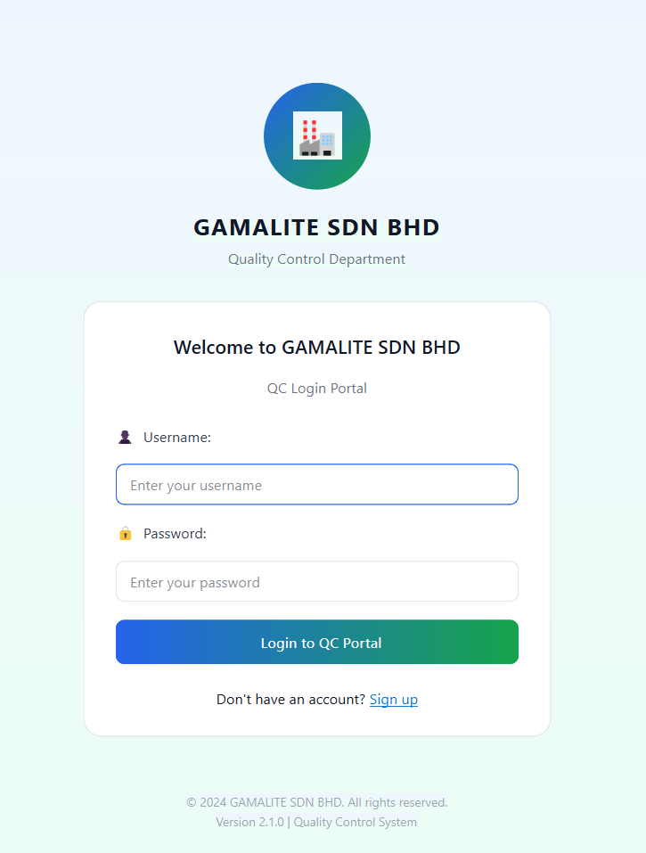
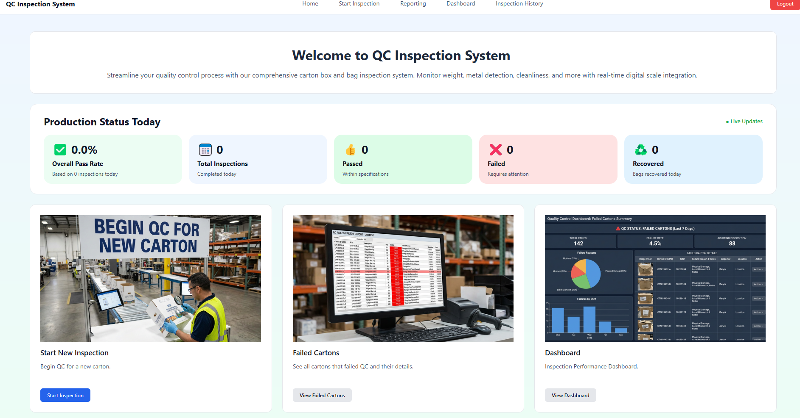
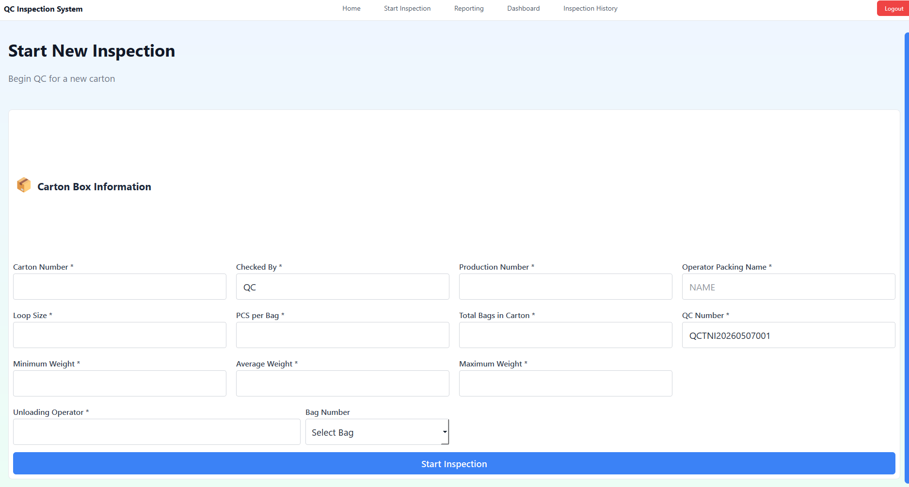
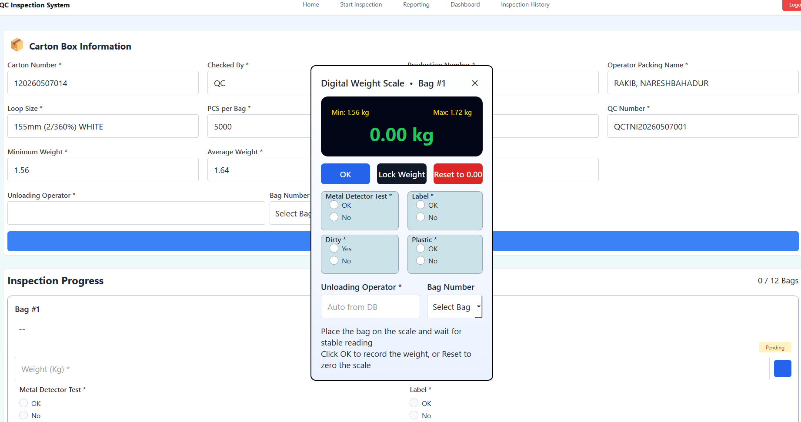
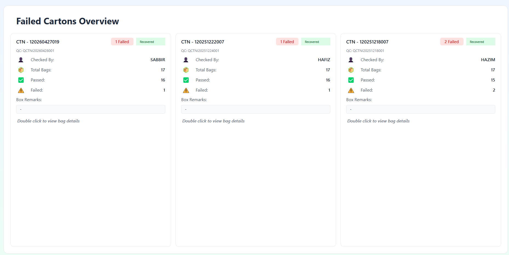
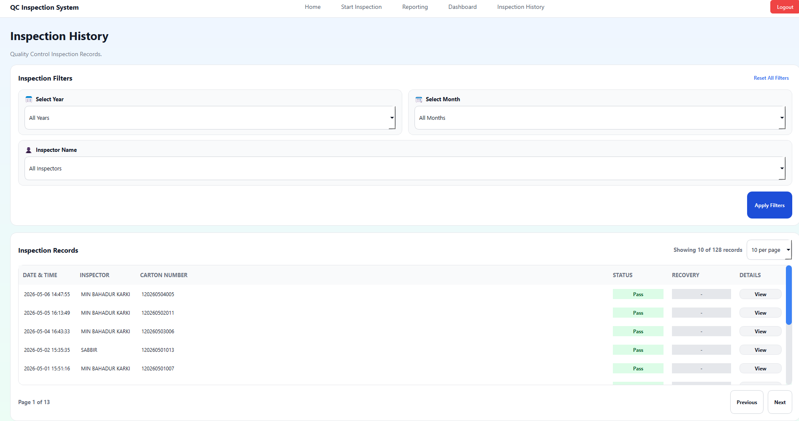
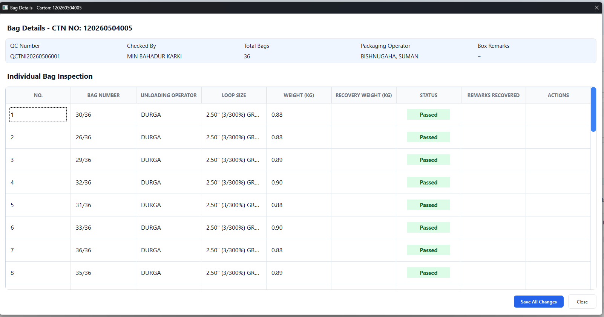

# QC Inspection System - Carton Quality Control Dashboard

A Python desktop application for industrial carton and bag quality control inspection.
The system is designed for production QC teams to record carton condition, bag weight, metal detector test, label check, dirty check, plastic check, final pass/fail status, and inspection history.

## Main Features

- QC login portal
- Start new carton inspection workflow
- Auto-generated QC number
- Carton number lookup from MySQL
- Production details lookup from MySQL
- Digital weighing scale popup for bag weight entry
- Bag-by-bag inspection progress
- Pass / Fail / Pending status tracking
- Failed carton overview
- Inspection history with filters
- Dashboard summary for QC performance
- MySQL data logging

## Screenshots

### Login Portal


### Home Page


### Start New Inspection Form


### Digital Weight Scale Popup


### Failed Cartons Overview


### Inspection History


### Bag Details


## Tech Stack

- Python
- PySide6 / Qt
- MySQL
- Modbus scale integration using pymodbus
- Windows batch launcher included

## Installation

```bash
pip install -r requirements.txt
```

## Configuration

Do not hard-code real MySQL passwords in public GitHub repositories.
Use environment variables instead. A sample file is provided:

```bash
.env.example
```

Set your MySQL details before running the app:

```bash
DB_HOST=127.0.0.1
DB_PORT=3306
DB_USER=root
DB_PASSWORD=your_mysql_password
DB_NAME=gama
```

## Run

Windows:

```bat
run_qc.bat
```

Linux / Jetson / Ubuntu:

```bash
./run_qc.sh
```

Or run directly:

```bash
python qc_form.py
```

## Notes

This repository is prepared for portfolio/demo use. Before using in production, update database credentials, table schema, COM port settings, and scale register settings based on your factory setup.

## Suggested Repository Name

```text
qc-inspection-system
```
